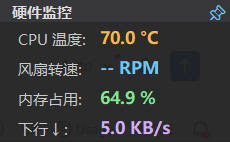

# TraySensor — Windows 右下角托盘硬件监控小工具

一个常驻在 Windows 系统托盘（右下角）的硬件监控小工具，原生 WinForms + .NET 8 + LibreHardwareMonitorLib 开发，编译后可以打包为**单个独立 exe**，自带运行时、占用极低、无需安装。



> 上图即为 TraySensor 悬浮监控窗口的实际运行效果（CPU 温度、风扇转速、内存占用、WiFi 下行速度）。

---

## ✨ 功能一览

| # | 功能 | 说明 |
|:-:|------|------|
| 1 | **托盘图标动态变色** | 按 CPU 温度自动切换 🟢绿 / 🟡橙 / 🔴红 三档，中心显示温度数值 |
| 2 | **悬浮监控窗口** | 右下角常驻无边框深色小窗体，可拖拽移动，不显示在任务栏 |
| 3 | **置顶切换** | 标题栏 📌 按钮 + 托盘右键菜单「置顶显示」两种方式切换；取消置顶后依然高于桌面 |
| 4 | **CPU 温度** | 精确到 0.1 °C（支持 Intel / AMD，含 Tctl / Tdie / CCD / Core Max 等多种命名） |
| 5 | **风扇转速** | 读取主板 SuperIO / EmbeddedController 上的 Fan 传感器，单位 RPM |
| 6 | **内存占用** | 全系统内存使用率百分比，阈值颜色预警 |
| 7 | **WiFi 下行速度** | **仅优先显示 WiFi 网卡**的下载速度，自动在 B/s / KB/s / MB/s 之间切换；鼠标悬停可看到实际用了哪一张网卡 |
| 8 | **右键菜单** | 显示监控窗口 / 置顶显示 / 立即刷新 / 导出传感器诊断日志 / 硬件初始化状态 / 退出 |
| 9 | **传感器诊断** | 一键把所有硬件与传感器（包括风扇值/网卡名）写入 `TraySensor_Sensors.log`，风扇/网速读不到时直接用它分析 |
| 10 | **单文件发布** | `dotnet publish` 直接产出一个 exe，复制双击就能跑，不需要用户安装 .NET 运行时 |
| 11 | **管理员权限清单** | 内置 `app.manifest` 强制要求管理员权限运行，底层硬件传感器（温度/风扇）才能读到 |

监控窗口阈值颜色规则：

| 指标 | 普通 | 预警 | 危险 |
|------|------|------|------|
| CPU 温度 | < 70 °C | 70 ~ 84.9 °C | ≥ 85 °C |
| 内存占用 | < 70 % | 70 ~ 84.9 % | ≥ 85 % |
| 下行速度 | < 5 MB/s | — | ≥ 5 MB/s |

---

## 📁 项目结构

```
TraySensor/
├─ TraySensor.csproj          主项目配置（.NET 8 + WinForms + 单文件发布 + 只编译 4 个源文件）
├─ app.manifest               强制 requireAdministrator 提权清单
├─ traysensor.jpg             原始应用图标素材（蓝紫渐变 CPU+温度计+风扇+下箭头）
├─ traysensor.ico             构建产物：由 IconBuilder 从 jpg 生成的多尺寸 ico（16~256）
├─ example.jpg                README 用的实际效果图（悬浮窗截图）
│
├─ Program.cs                 程序入口 + 全局异常捕获 + 错误日志 TraySensor_Error.log
├─ HardwareMonitor.cs         硬件采集核心（LibreHardwareMonitor 封装）
│                              · CPU 温度 / CPU 负载 / 风扇 RPM / 内存占用
│                              · 仅优先 WiFi 网卡的下行下载速度
│                              · 递归遍历所有 Hardware + SubHardware（含 SuperIO/EC）
│                              · DumpSensorsToLog() 一键导出所有传感器到日志
├─ FloatWindow.cs             右下角悬浮小窗体
│                              · 无边框 / 深色 / 半透明 / 可拖拽
│                              · 📌 置顶按钮切换 TopMost
│                              · 4 行数据：温度 / 风扇 / 内存 / 下行 ↓
│                              · 下行 ↓ 悬停 ToolTip 显示实际网卡名（WiFi / 回退）
├─ TrayApplicationContext.cs  托盘主逻辑
│                              · NotifyIcon 右键菜单
│                              · 1 秒 Timer 刷新数据 + 动态生成图标
│                              · 菜单提供「导出传感器诊断日志」
│
└─ IconBuilder/               辅助工具（构建图标用，运行时不会被打包进主 exe）
   ├─ TraySensor.IconBuilder.csproj
   └─ Program.cs              把 traysensor.jpg 高质量缩放输出多尺寸 traysensor.ico
```

主项目使用 `<EnableDefaultCompileItems>false</EnableDefaultCompileItems>` 只显式编译上面 4 个源文件，避免项目根目录下用于参考的 LibreHardwareMonitor 源码被 SDK 误扫描而产生冲突。

---

## 🧩 技术栈

- **语言 / 运行时**：C# 12 + .NET 8（WinForms，非 WPF）
- **硬件采集**：[LibreHardwareMonitorLib](https://www.nuget.org/packages/LibreHardwareMonitorLib) `0.9.4`
  - 为什么不用 WMI：Windows 原生 WMI **读不到 CPU 温度和风扇转速**，必须走该库直接访问 LPC/SuperIO/EC
  - 需要管理员权限
- **发布模式**：`SelfContained + PublishSingleFile + EnableCompressionInSingleFile`
  - 单个 exe，自带 .NET 运行时，任何 Win x64 电脑双击即可
- **刷新频率**：1 秒一次（CPU / 风扇 / 内存 / 下行速度同步刷新）

---

## 🚀 编译与发布

### 前置要求
- 安装 [.NET 8 SDK x64](https://dotnet.microsoft.com/download/dotnet/8.0)
- Windows 10 / 11 x64

### 步骤 1：恢复并 Debug 验证
```powershell
cd X:\project\2026\work10\TraySensor
dotnet restore
dotnet build -c Debug
```

### 步骤 2：生成应用图标（只有第一次 / 更换 jpg 素材才需要）
```powershell
dotnet run --project .\IconBuilder\TraySensor.IconBuilder.csproj --framework net8.0-windows -- `
  "X:\project\2026\work10\TraySensor\traysensor.jpg" `
  "X:\project\2026\work10\TraySensor\traysensor.ico"
```
> 仓库里已经提供生成好的 `traysensor.ico`，这步可以跳过。

### 步骤 3：发布单文件 exe
```powershell
dotnet publish -c Release -r win-x64 --self-contained true `
  -p:PublishSingleFile=true `
  -p:EnableCompressionInSingleFile=true `
  -p:IncludeAllContentForSelfExtract=true
```

发布产物路径：
```
bin\Release\net8.0-windows\win-x64\publish\TraySensor.exe
```

> ⚠️ 如果 publish 时遇到 `error MSB4018 The process cannot access the file ... TraySensor.exe ... being used by another process`，说明旧的 TraySensor.exe 正在后台运行。请先退出托盘图标（右键→退出），或用任务管理器结束所有 `TraySensor.exe` 进程后重试。

---

## 🖱️ 使用说明

1. **启动**：右键 `TraySensor.exe` → **以管理员身份运行**（manifest 会自动弹 UAC 提权，点「是」即可）
2. **默认行为**：
   - 自动在屏幕右下角显示悬浮监控窗口（默认置顶）
   - 任务栏托盘区出现一个彩色圆形图标（中心显示 CPU 温度数值）
3. **交互**：
   | 操作 | 效果 |
   |------|------|
   | 左键单击托盘图标 | 显示 / 隐藏悬浮窗 |
   | 悬浮窗标题栏 📌 按钮 | 切换置顶 / 取消置顶（取消后仍高于桌面） |
   | 右键托盘图标 → 显示监控窗口 | 菜单勾选式开关 |
   | 右键托盘图标 → 置顶显示 | 菜单勾选式开关 |
   | 右键托盘图标 → 立即刷新 | 立刻拉一次硬件数据 |
   | 右键托盘图标 → 导出传感器诊断日志 | 生成 `TraySensor_Sensors.log` 并高亮选中它 |
   | 右键托盘图标 → 最后一项「退出」 | 关闭悬浮窗 + 释放硬件资源 + 退出 |
4. **下行速度怎么确认选的是 WiFi？**
   把鼠标悬停在悬浮窗「下行 ↓」标签或右侧数值上，会弹出 ToolTip：
   ```
   [WiFi] 当前网卡: Intel(R) Wi-Fi 6 AX201 160MHz
   ```
   如果选到了其他网卡，会显示 `[非WiFi(回退)]`，说明当前没有识别到 WiFi 硬件（台式机插网线常见）。

---

## ❓ 常见问题（FAQ）

**Q1：风扇转速显示 `-- RPM`，怎么办？**
1. 确认「以管理员身份运行」，非管理员一定读不到主板风扇寄存器。
2. 右键托盘 → **导出传感器诊断日志**，把同目录下 `TraySensor_Sensors.log` 的内容发给开发者，根据日志里所有 `SensorType.Fan` 的名字做针对性匹配（因为不同主板/BIOS 命名差异很大，比如 `Fan #1` / `CPU Fan` / `SYS Fan 1` / `CPU_OPT`…）。

**Q2：网速只有几十 KB/s，明明实际下载有几 MB/s？**
就是选错了网卡。把鼠标悬停在悬浮窗「下行 ↓」这一行，看 ToolTip 里显示的网卡名是不是你正在使用的那张 WiFi。不是的话，请导出传感器诊断日志，或者告诉开发者具体的 WiFi 适配器显示名称，可在匹配函数 `IsWifiHardware()` 里补关键词。

**Q3：悬浮窗打开后被别的窗口挡住？**
点一下标题栏右上角的 📌 变成蓝色，即为「置顶」状态；或者托盘右键勾选「置顶显示」。

**Q4：资源管理器里 exe 缩略图/图标没更新？**
Windows 有图标缓存。最简单办法：把 exe 复制一份重命名，看新文件图标是否正确；或者运行 `ie4uinit.exe -show` 清理图标缓存；必要时重启 Explorer。

**Q5：怎么开机自启？**
1. Win+R 输入 `shell:startup` 回车，打开启动文件夹；
2. 把 `TraySensor.exe` 的**快捷方式**放进去；
3. 右键快捷方式 → 属性 → 快捷方式 → 高级 → 勾选「以管理员身份运行」→ 确定。

---

## 🪪 License

项目代码 MIT；LibreHardwareMonitorLib 遵循其本身的开源协议（MPL 2.0）。
